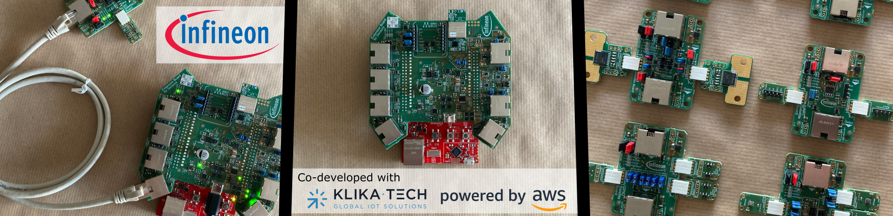
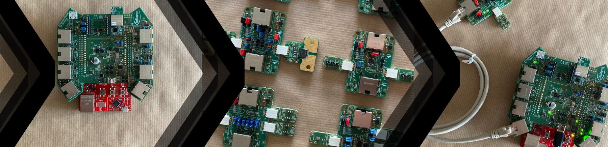

# XENSIV™ Predictive Maintenance Evaluation Kit EVAL_XMC47_PREDMAIN_AA <!-- omit in toc -->



__This repository is integrating a forked version of the main FreeRTOS github [repo](https://github.com/Infineon/amazon-freertos).  
This projects provides the software support of the XENSIV™ Predictive Maintenance Evaluation Kit [EVAL_XMC47_PREDMAIN_AA](https://www.infineon.com/cms/en/product/evaluation-boards/eval_xmc47_predmain_aa/) for condition monitoring and predictive maintenance.__

## Table of Content <!-- omit in toc -->
- [Folder Overview](#folder-overview)
- [Quick Start Guide](#quick-start-guide)
- [Introduction](#introduction)
  - [Summary of Features](#summary-of-features)
  - [Benefits](#benefits)
  - [Preview and More Information](#preview-and-more-information)
- [Getting Started](#getting-started)
- [Cloning](#cloning)
- [Known Problems and Support](#known-problems-and-support)
- [License](#license)

## Folder Overview
```
pred-main-xmc4700-kit/
┣ amazon-freertos/      # Amazon FreeRTOS firmware for EVAL_XMC47_PREDMAIN_AA kit
┣ cdk-script/           # AWS CDK script for AWS infrastructure deployment
┣ docs/                 # Documentation
┣ patch/                # Quick-start firmware
┗ README.md             # This document
```

## Quick Start Guide



To directly access the [**Getting Started Guide**](/docs/00_QuickStart.md) for the evaluation kit, click the corresponding link [here](/docs/00_QuickStart.md).  

## Introduction
The XENSIV™ Predictive Maintenance Evaluation Kit EVAL_XMC47_PREDMAIN_AA is the perfect start for evaluating sensor-based condition monitoring and predictive maintenance use cases for HVAC equipment.

This kit utilizes Infineon’s broad XENSIV™ sensor portfolio along with the FreeRTOS XMC4700 Arm® Cortex®-M4F XMC™ qualified device to monitor the condition of most crucial HVAC elements such as filters, compressors, motors or fans. Based on the collected sensor data, e.g. of current consumption, air flow, and many others upcoming system failures can be detected.  
Moreover, AWS cloud powered anomaly detection is implemented with a random cut forrest algorithm to distinguish normal and non-normal system operation.

Thanks to the AWS CloudFormation template and a FreeRTOS enabled software stack, a full end-to-end solution from the edge to the AWS cloud can be quickly set up. Hardware security enabled multi-account registration allows users to deploy a potential solution at scale and enroll it securely in the AWS cloud.

Potential applications besides HVAC equipment include motors, fans, compressors, drives and more equipment of Smart Buildings.
Additionally, the kit can be used for other application areas including Industry 4.0.

### Summary of Features
* Extension for the XMC4700 XMC™ Relax Kit
* Full software support of the Amazon FreeRTOS kernel
* AWS cloud integration
* AWS cloud based anomaly detection
* Full AWS CloudFormation template and software application stack
* On-board Wi-Fi connectivity
* mikroBUS™ ClickBoard interface for extending connectivity with [LTE IoT 2 click](https://www.mikroe.com/lte-iot-2-click)
* XENSIV™ Sensor Satellite Boards with a set of sensors for data collection and condition monitoring  
* AWS Multi-Account registration support with OPTIGA™ Trust M secure-element 

### Benefits
All-in-one evaluation kit to implement and test AWS enabled predictive maintenance and condition monitoring use-cases for HVAC equipment.  
Quick-start and cloud formation templates enable fast evaluation of sensor-based condition monitoring and predictive maintenance.

* Current monitoring (up to 120 A), e.g. for overall current anomaly detection
* Vibration and position sensing, e.g. for drives and compressor
* Air-flow and pressure measurement, e.g. for filters
* Open/closed lid detection, e.g. for detecting status of service lids
* Hall speed sensors, e.g. for blocked fan and fan speed monitoring
* Sound anomaly detection, e.g. for gears and joints

### Preview and More Information
You can find more information about the kit, its content and videos on the official board page on Infineon.com here:

[**Link to the official board page**](https://www.infineon.com/cms/en/product/evaluation-boards/eval_xmc47_predmain_aa/)

If you want to get started with the kit, please follow our Getting Started guide as part of this repository.
Moreover, you can find all additional information and documentation also here:

**Infineon EVAL_XMC47_PREDMAIN_AA Kit**
* [Getting Started Guide](/docs/00_QuickStart.md)
* [Generic documentation](/docs/README.md)
* [Hardware documentation](/docs/02_Hardware/01_Overview.md)
* [Software documentation](/docs/03_Software/01_SoftwareDevelopment.md)
* [AWS Device Catalog listing]()
* IDE: [DAVE™](https://infineoncommunity.com/dave-download_ID645)

## Getting Started
**Quick Start**  
To directly access the [**Getting Started Guide**](/docs/00_QuickStart.md) for the evaluation kit, click the corresponding link [here](/docs/00_QuickStart.md).  

**Overall Documentation**  

The overall documentation including all information for hardware, software, and AWS infrastructure can by accessed [here](/docs/README.md).  
For more information on FreeRTOS, refer to the [Getting Started section of FreeRTOS webpage](https://aws.amazon.com/freertos).  
For detailed documentation on FreeRTOS, refer to the [FreeRTOS User Guide](https://aws.amazon.com/documentation/freertos).

## Cloning
This repo uses [Git Submodules](https://git-scm.com/book/en/v2/Git-Tools-Submodules) to bring in dependent components.

Note: if you download the ZIP file provided by GitHub UI, you will not get the contents of the submodules. (The ZIP file is also not a valid git repository)

To clone using HTTPS:
```
git clone https://github.com/Infineon/pred-main-xmc4700-kit.git --recurse-submodules
```
Using SSH:
```
git clone git@github.com:Infineon/pred-main-xmc4700-kit.git --recurse-submodules
```

If you have downloaded the repo without using the `--recurse-submodules` argument, you need to run:
```
git submodule update --init --recursive
```

## Known Problems and Support
Currently, there are no known problems or limitations. 

**Note:** please open an issue as part of this repository if you need help or support with specific problems.

## License
This repository is licensed under the EVAL_XMC47_PREDMAIN_AA Evaluation Software License Agreement V1.0.  
The EVAL_XMC47_PREDMAIN_AA Evaluation Software License Agreement can be found in the `LICENSE.txt` file at the root of the repository or here:

[LICENSE](/LICENSE.txt)

This repository contains software components licensed under 3rd party licenses or Open Source Software (OSS) as part of this software package, e.g. Amazon FreeRTOS.   
The respective license files are part of the software components and/or referenced in the source files. For the Amazon FreeRTOS section, the respective `LICENSE` file is stored [here](/amazon-freertos/LICENSE).

Details on how to obtain the licenses are provided as part of the software components.

Please contact Infineon Technologies AG for questions regarding the software licensing.