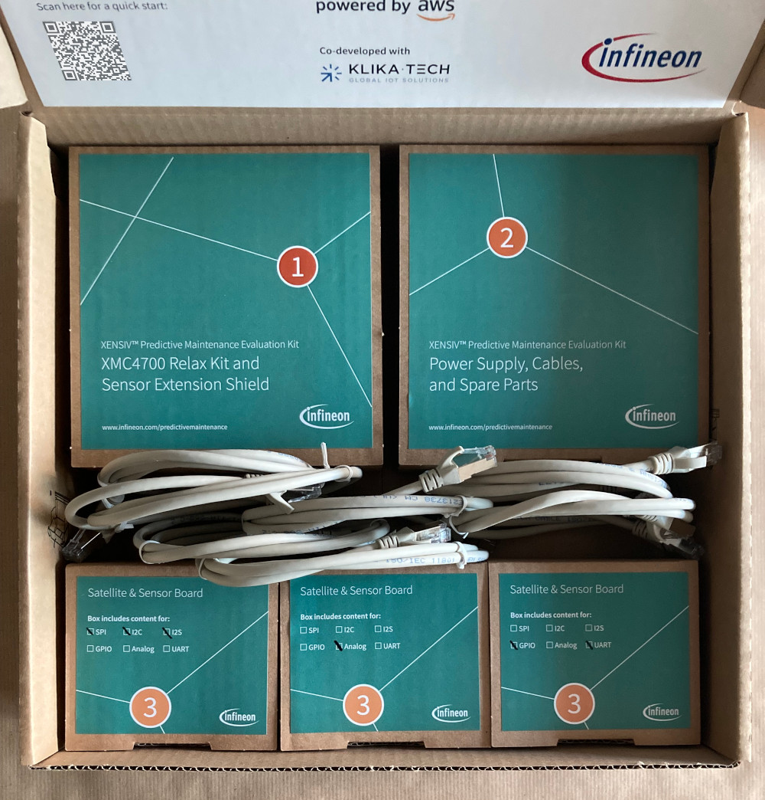
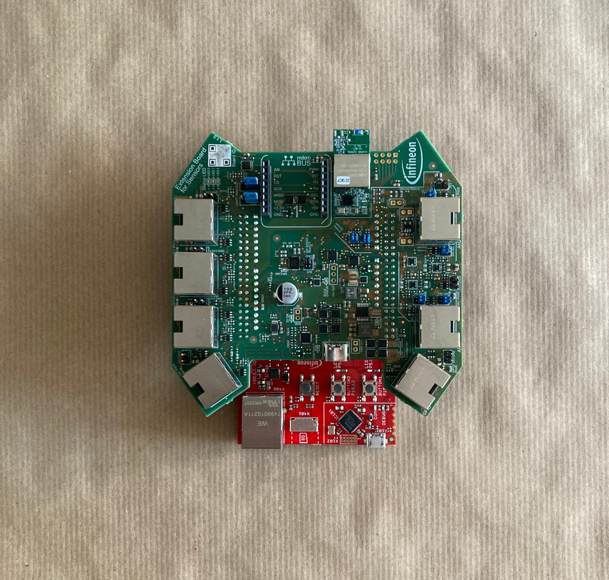
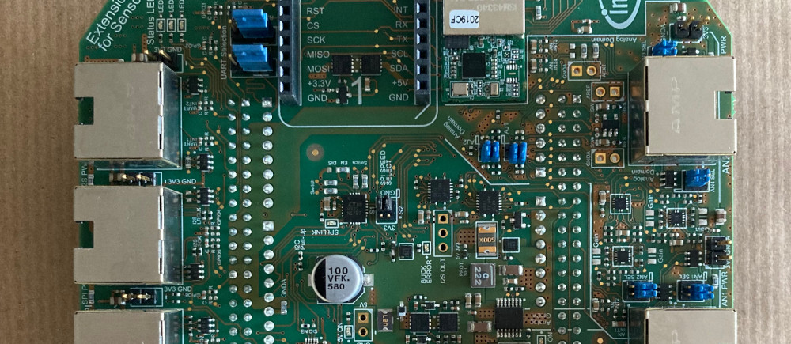
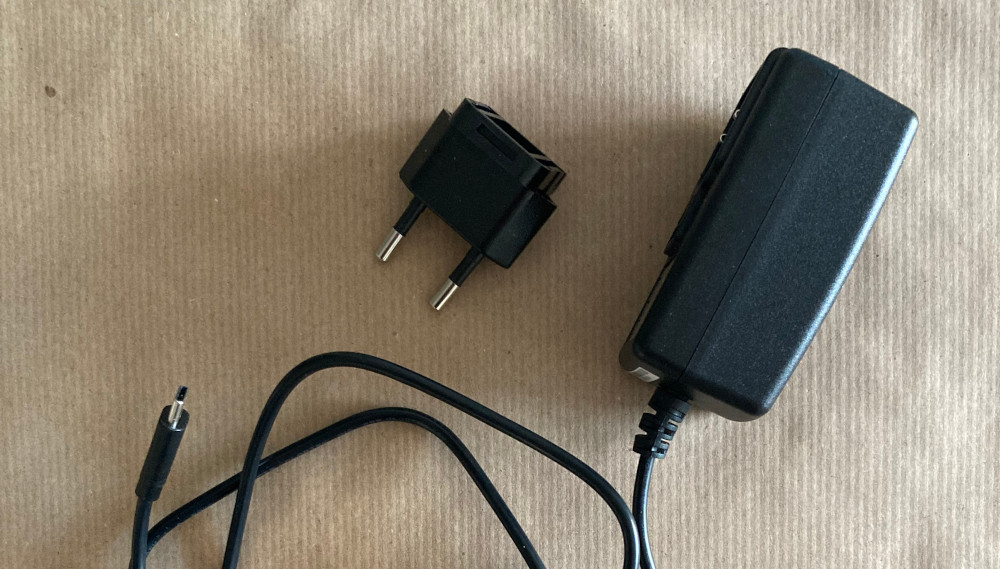
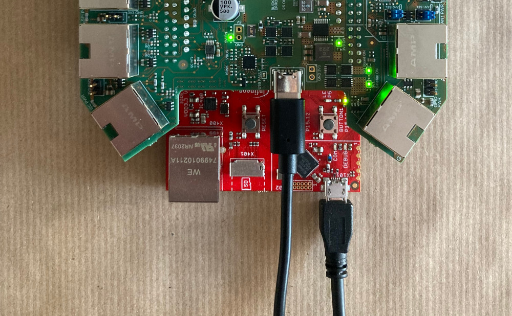
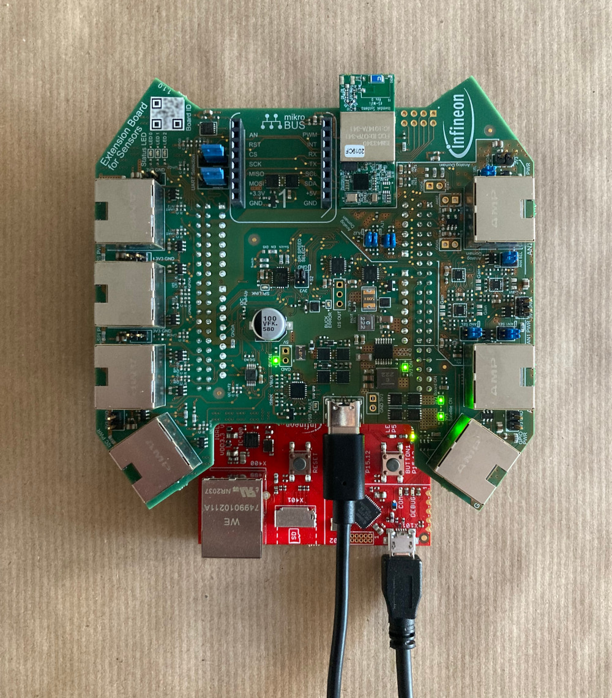
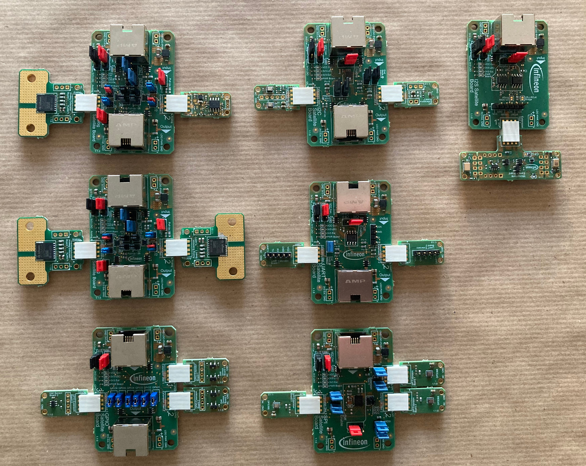
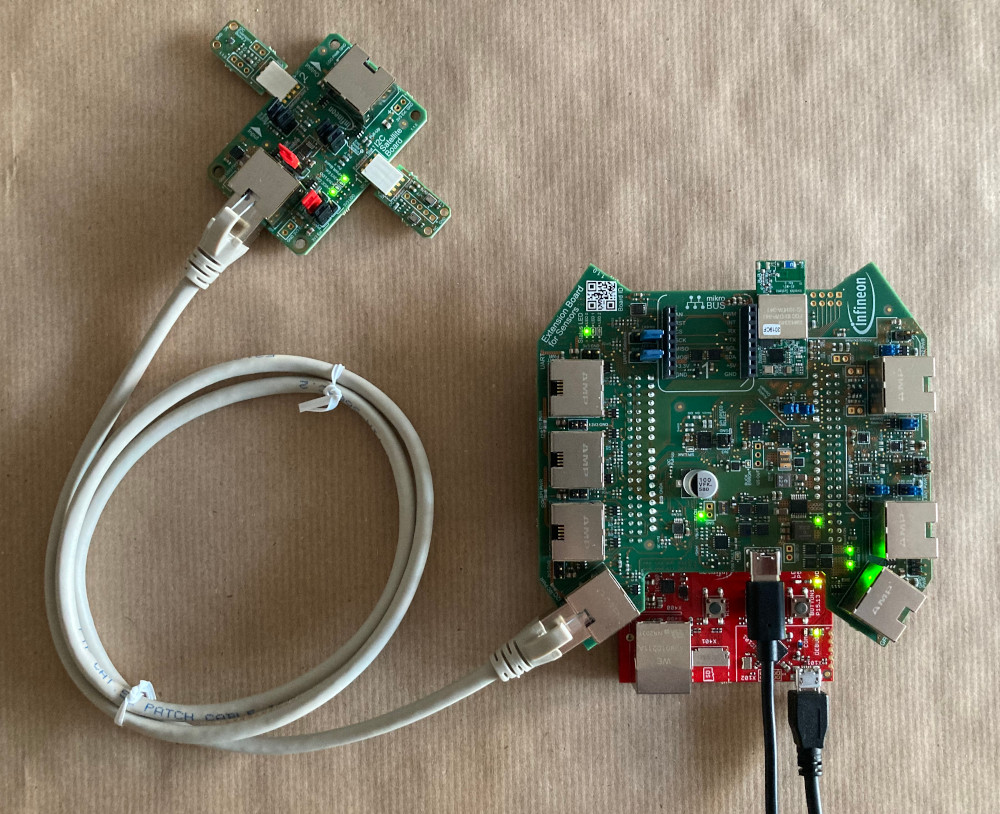

# Step-by-Step Hardware Setup Guide <!-- omit in toc -->

## Table of Content <!-- omit in toc -->
- [Introduction](#introduction)
- [Unboxing](#unboxing)
- [Hardware Setup Checklist & Preparation](#hardware-setup-checklist--preparation)
- [First Operation of the Kit](#first-operation-of-the-kit)
- [Attaching Satellite Boards](#attaching-satellite-boards)
- [Establishing a Connection to a PC](#establishing-a-connection-to-a-pc)
- [Troubleshooting](#troubleshooting)
- [Known Problems and Support](#known-problems-and-support)

## Introduction
This document provides a step-by-step guide on setting up the kit and getting started.  
Overall, the EVAL_XMC47_PREDMAIN_AA kit consists of the following elements:

* 1x XMC4700 Relax Kit as mainboard
* 1x Extension Board for Sensors to be combined with XMC4700 Relax Kit
* 7x Satellite Boards to be connected to Extension Board for Sensors
* 13x Sensor Boards to be connected to Satellite Boards

## Unboxing
The EVAL_XMC47_PREDMAIN_AA kit is provided in a box containing all boards, supplies and material to get started.  
Below picture shows the packaging of the kit and its content if you open it. You will find further instructions and details on the inside of the box-lid as well.

The box contains smaller packages that hold all respective boards and supplies:

* Box labelled 1: Mainboard
  * 1x XMC4700 Relax Kit
  * 1x Extension Board for Sensors (mounted on top of XMC4700 Relax Kit)
* Box labelled 2: Additional Components
  * 1x USB Type-C Power Supply with international adapters
  * 1x Micro USB cable
  * PCB adapters for Satellite and Sensor Boards
  * Connector cables for adapters
  * Magnets
* Box labelled 3: Satellite Boards
  * One box containing 1x UART & 1x GPIO Satellite Boards as well as Sensors/Adapters
  * One box containing 1x I2S, 1x I2C and 1x SPI Satellite Boards as well as Sensors
  * One box containing 2x Analog Satellite Boards as well as Sensors
* 7x 1 m Ethernet cables

## Hardware Setup Checklist & Preparation
Before continuing with the hardware setup, ensure that all elements as listed in [Unboxing](#unboxing) are available.  
For the first steps, please prepare the following elements:

* 1x XMC4700 Relax Kit with mounted Extension Board for Sensors
* 1x Micro USB cable
* 1x USB Type-C power supply with international adapters

Please continue with [First Operation of the Kit](#first-operation-of-the-kit).

## First Operation of the Kit

Please go through the following steps to start the kit and prepare it from a hardware point of view:

1. Take the XMC4700 Relax Kit with mounted Extension Board for Sensors and put it in front of you:  
  
2. Compare the Extension Board for Sensors and ensure that all jumpers are set as shown here:  
  

3. Take the USB Type-C power supply and mount the respective adapter for your region, here an example with the Europlug:  
  

4. Connect the USB Type-C power supply to the USB Type-C plug of the Extension Board for Sensors. Check that the *5V ON* and *3V3 ON* LEDs of the Extension Board for Sensors are switched on (other LEDs are only switched on if the [correct firmware](../../patch/README.md) is already flashed to the XMC4700 Relax Kit):    
  

1. Afterwards, you can now connect the micro USB cable from a PC to the XMC4700 Relax Kit as shown here:  
  

The system should now look like as shown in the following picture:  

**IMPORTANT NOTE:** Only the XMC4700 Relax Kit [KIT_XMC47_RELAX_V1](https://www.infineon.com/cms/en/product/evaluation-boards/kit_xmc47_relax_v1/) is supported as part of the EVAL_XMC47_PREDMAIN_AA kit.  
The XMC4700 kit supplied as part of the EVAL_XMC47_PREDMAIN_AA kit fulfills this requirement.

If you do not use the XMC4700 Relax Kit provided along with the EVAL_XMC47_PREDMAIN_AA kit, please kindly check its suitability.

If the respective power LEDs are powered on, the kit is working and ready for next steps. The power LEDs *3V3 Satellite ON* and *3V3 Board ON* do not necessarily have to be switched at this stage of the step-by-step guide.   
If you face issues, please consult the [Troubleshooting](#troubleshooting) to try to resolve it.

Please continue from [Attaching Satellite Boards](#attaching-satellite-boards).

## Attaching Satellite Boards
Before continuing here, please ensure that...:
* ...you have completed all steps as described in [First Operation of the Kit](#first-operation-of-the-kit).
* ...you have already flashed the correct firmware for the XMC4700 Relax kit, either:
  * as shown in the quick-start guide [here](../../patch/README.md) for a basic setup.
  * as shown in the full software development documentation [here](../03_Software/01_SoftwareDevelopment.md).

If the kit is up and running, the next steps include connecting the Satellite Boards.  
As it can be seen in [First Operation of the Kit](#first-operation-of-the-kit) , the Extension Board for Sensors has 7 RJ45 connectors.  
Every connector is designed for a respective hardware interface as indicated on the board by the respective silk-screen label.  

Overall, the Extension Board for Sensors has the following interfaces:

* Side One
  * 1x I2C RJ45 connector
  * 1x SPI RJ45 connector
  * 1x I2S RJ45 connector
  * 1x UART RJ45 connector
* Side Two
  * 1x GPIO RJ45 connector
  * 1x Analog AN1 RJ45 connector
  * 1x Analog AN2 RJ45 connector

Please note that these connectors are only used as physical connections for the twisted-pair cabling.  
They do not implement higher level Ethernet functionality, but are rather mapped as explained in the [hardware documentation](./01_Overview.md).  
Please refer to the respective section of the [Extension Board for Sensors Documentation](./03_ExtensionBoard.md) to get further details.

As a next step, please take the Satellite Boards out of the box and check that all sensor boards are correctly mounted to them.  
Please compare all boards with the below picture to ensure that all jumpers are correctly set and the sensors are mounted.

If everything is set up correctly for the Satellite Boards, connect each one to the respective interface with an Ethernet cable.  

**IMPORTANT:** Satellite Boards with two RJ45 plugs can be daisy chained. Here, the respective RJ45 connectors are clearly marked with *INPUT* and *OUTPUT*. The RJ45 port labelled with *INPUT* has to be connected to the Extension Board for Sensors.

The following picture shows an example of the I2C Satellite Board connected to the I2C RJ45 connector of the Extension Board for Sensors:

Please connect all Satellite Board RJ45 connectors (marked as *INPUT* if more as one is present) as outlined here to the Extension Board for Sensors:

* I2C Satellite Board to I2C RJ45 connector
* SPI Satellite Board to SPI RJ45 connector
* I2S Satellite Board to I2S RJ45 connector
* UART Satellite Board to UART RJ45 connector
* GPIO Satellite Board to GPIO RJ45 connector
* Analog Satellite Board with two current sensors to Analog AN1 RJ45 connector
* Analog Satellite Board with one current sensor to Analog AN2 RJ45 connector

If the basic configuration has not been changed, the Satellite Boards are powered via the twisted-pair Ethernet cabling from the Extension Board for Sensors.  
A power switch on the Extension Board for Sensors controls the 3.3 V voltage applied to the RJ45 connectors and has to be turned on in the firmware.  
For the basic firmware from the [quick-start guide](/docs/00_QuickStart.md), this is automatically done if no problem such as a short-circuit is present.  

If everything is connected correctly, please check now that the respective power LEDs of the Satellite Boards are switched on.  
For the basic setup with the firmware of the [quick-start guide](../../patch/README.md), the LED with *VCC Con.* and *PWR Board* of Satellite Boards should be turned on.

If you face issues, please consult the [Troubleshooting](#troubleshooting) to try to resolve it.

Please continue from [Establishing a Connection to a PC](#establishing-a-connection-to-a-pc).

## Establishing a Connection to a PC
If all steps from [First Operation of the Kit](#first-operation-of-the-kit) and [Attaching Satellite Boards](#attaching-satellite-boards) are successfully carried out, we can now establish a connection to the PC.  
If not done earlier, please take now the micro USB cable and connect it from the on-board SEGGER J-Link debugger of the XMC4700 Relax Kit to a USB port of a PC.  
Please make sure that the correct USB port of the XMC4700 Relax Kit is used (it has two ones and the one on the same side as the USB Type-C connector is the correct one).

To establish now a serial connection, please ensure that you followed the steps as described in the [Software Development](../03_Software/01_SoftwareDevelopment.md) document.  
Especially, ensure that the SEGGER J-Link drivers are installed so that the XMC4700 Relax Kit is correctly recognized.

The detailed description for the serial connection can be found [here](../03_Software/01_SoftwareDevelopment.md#establishing-a-serial-connection-for-debugging).

The hardware is now correctly set up and ready for software development and cloud deployment.

## Troubleshooting
* Components are missing
  * Please contact the sales representative from where you have purchased the kit
* The Extension Board for Sensors/XMC4700 Relax Kit is not powering up
  * Please ensure that the USB Type-C power supply is correctly connected
  * Please ensure that the wall socket is providing power
  * Please ensure that the *USB FAULT* LED is not switched on.  
    If it is switched on, please try another 15 W USB Type-C PSU mit 5 V output.
  * Please ensure that the *5V ON* LED is switched on.  
    If it is switched off, there is a problem with the USB Type-C power supply.  
    Either replace it or check the connection to the grid.
  * Please ensure that the the *3V3 ON* LED is switched on.  
    If it is switched off, please check that the BUCK ERROR LED is not switched on.
    If the *BUCK ERROR* LED is on, there is probably a short circuit, so disconnect all Satellite Boards and check the connection.
* The Satellite Boards are not powering up (*PWR Board* LED off)
  * Check that all jumpers are correctly set, especially the *PWR Select* one.  
    Please refer to the documentation of the Satellite Boards for more details.
  * Please check that the *3V3 Satellite ON* LED of the Extension Board for Sensors is switched on.  
    If it is switched off, please ensure that the Extension Boarf for Sensors is correctly switched on.
    Moreover, please ensure that you have flashed the correct firmware of the XMC4700 Relax Kit so that the power switch is turned on.
  * Please ensure that the Ethernet cable is correctly connected and not broken.
* Serial connection is not working
  * Ensure that all drivers are correctly installed
  * Ensure that the correct USB port of the XMC4700 Relax Kit is used.  
    Use the one close to the LED marked with DEBUG and next to the SD card slot.
  * Ensure that the correct settings are used for the serial connection (baud rate, etc.)

## Known Problems and Support
Currently, there are no known problems or limitations. 

**Note**: Please open an issue as part of this repository if you need help or support with specific problems.