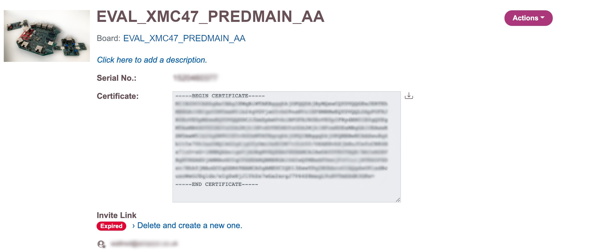

# Software Development Setup <!-- omit in toc -->

## Table of Content <!-- omit in toc -->
- [Setting up the Development Environment](#setting-up-the-development-environment)
  - [Install DAVE™](#install-dave)
  - [Install CMake](#install-cmake)
  - [Install SEGGER J-Link](#install-segger-j-link)
  - [Additional XMC™ Software References](#additional-xmc-software-references)
- [Establishing a Serial Connection for Debugging](#establishing-a-serial-connection-for-debugging)
- [Download FreeRTOS and Open the Project](#download-freertos-and-open-the-project)
  - [Import the Project into DAVE™](#import-the-project-into-dave)
  - [Get the Certificate from the OPTIGA™ Trust M with Infineon Toolbox](#get-the-certificate-from-the-optiga-trust-m-with-infineon-toolbox)
  - [Get the Certificate from the OPTIGA™ Trust M with a Serial Connection](#get-the-certificate-from-the-optiga-trust-m-with-a-serial-connection)
- [Build and Run the FreeRTOS Firmware](#build-and-run-the-freertos-firmware)
  - [Configure the Software: Credentials](#configure-the-software-credentials)
  - [Configure the Software: Sensor Setup](#configure-the-software-sensor-setup)
  - [Build and Run with DAVE™](#build-and-run-with-dave)
  - [Build and Run with CMake](#build-and-run-with-cmake)

# Setting up the Development Environment
Developers can choose to use either the Infineon DAVE™ IDE or use CMake with command-line. DAVE™ is only supported on Windows, and CMake is supported on Windows, Linux and MacOS. Additionally, users will need to install SEGGER J-Link tools to access the onboard debugger and flash the device.

If you choose to use DAVE™, follow the steps in [Install DAVE™](#install-dave) to install DAVE™.
If you are using CMake, follow [Install CMake](#install-cmake).

## Install DAVE™
Note that DAVE™ is supported on Windows platforms only.

1. Go to Infineon's [DAVE™ software download](https://infineoncommunity.com/dave-download_ID645) page

1. Choose the DAVE™ package for your operating system and submit your registration information.  
   After registration, you should receive a confirmation email with a link to download a `.zip` file.

2. Download the DAVE™ package `.zip` file (`DAVE_version_os_date.zip`), and unzip it to the location where you want to install DAVE™ (for example, `C:\DAVE4`).  
   **Note**  
   Some Windows users have reported problems using Windows Explorer to unzip the file. We recommend that you use a third-party program such as 7-Zip.  
   Moreover, some Windows users have reported limitation with the [maximum path length](https://docs.microsoft.com/en-us/windows/win32/fileio/naming-a-file#:~:text=the%20current%20drive.-,Maximum%20Path%20Length%20Limitation,required%20to%20remove%20the%20limit.), especially when unzipping the DAVE™ environment or loading project with nested folders.

1. To launch DAVE™, run the executable file found in the unzipped `DAVE_version_os_date.zip` folder

2. Go to [Install SEGGER J-Link](#install-segger-j-link) to install J-Link

## Install CMake
1. Set up the GNU Arm Embedded Toolchain

1. Download the toolchain from the [Arm Embedded Toolchain download page](https://developer.arm.com/tools-and-software/open-source-software/developer-tools/gnu-toolchain/gnu-rm/downloads).  
   **Note**  
   Due to [a bug reported](https://bugs.launchpad.net/gcc-arm-embedded/+bug/1810274) in the objcopy utility, we recommend that you download a version other than "8-2018-q4-major".

1. Open the downloaded toolchain installer and follow the instructions in the wizard

2. Install [CMake](https://cmake.org/) and [Ninja](https://github.com/ninja-build/ninja/releases).  
   For instructions, see [CMake Prerequisites](https://docs.aws.amazon.com/freertos/latest/qualificationguide/building-cmake-prereqs.html).
   
3. Go to [Install SEGGER J-Link](#install-segger-j-link) to install J-Link

## Install SEGGER J-Link
To communicate with the XMC4700 Relax Kit's on-board debugging probe, you need the drivers included in the J-Link Software and Documentation pack. You can download the J-Link Software and Documentation pack from Segger's [J-Link software download](https://www.segger.com/downloads/jlink/#J-LinkSoftwareAndDocumentationPack) page.

## Additional XMC™ Software References
For more information on DAVE™ IDE, see the [DAVE™ Quick Start Guide](https://www.infineon.com/dgdl/Infineon-DAVE_Quick_Start-GS-v02_00-EN.pdf?fileId=5546d4624cb7f111014d059f7b8c712d) and visit [DAVE™ Forum](https://www.infineonforums.com/threads/6212-Install-DAVE%C2%99-IDE-for-XMC%C2%99-microcontrollers).

For more information about using CMake with other operating systems and options, see [Using CMake with FreeRTOS](https://docs.aws.amazon.com/freertos/latest/userguide/getting-started-cmake.html).

# Establishing a Serial Connection for Debugging
To establish a serial connection between your host machine and your board:

1. Identify the USB serial port number for the connection to the board on your host computer. In Linux and macOS hosts, this will appear as a device in /dev/.  
   On Windows, this device will appear as a COM device.
2. Start a serial terminal and open a connection with the following settings:
   * Baud rate: 115200
   * Data: 8 bit
   * Parity: None
   * Stop bits: 1
   * Flow control: None

If you are using macOS or Linux, you can use screen. Run the following command:  
```screen /dev/tty.<your serial port> 115200```

If you are using Windows, you will need to install a terminal program.  

For more information about installing a terminal and setting up a serial connection, see [Installing a terminal emulator](https://docs.aws.amazon.com/freertos/latest/userguide/uart-term.html). 

# Download FreeRTOS and Open the Project
This repo uses [Git Submodules](https://git-scm.com/book/en/v2/Git-Tools-Submodules) to bring in dependent components.  
Note: If you download the ZIP file provided by GitHub UI, you will not get the contents of the submodules. (The ZIP file is also not a valid git repository)

To clone using HTTPS:
```
git clone https://github.com/Infineon/pred-main-xmc4700-kit.git --recurse-submodules
```
Using SSH:
```
git clone git@github.com:Infineon/pred-main-xmc4700-kit.git --recurse-submodules
```

If you have downloaded the repo without using the `--recurse-submodules` argument, you need to run:
```
git submodule update --init --recursive
```

If you are using CMake and a third party IDE, you can open the source code in your editor of choice.  
If you are using DAVE™ IDE, follow the instructions in [Import the Project into DAVE™](#import-the-project-into-dave).

## Import the Project into DAVE™

1. Start DAVE™ and select your workspace  
   

2. In DAVE™, choose **File**, and then choose **Import**. 
   
3. Expand the **Infineon** folder, choose **DAVE™ Project**, and then choose **Next**  
   

4. In the **Import DAVE™ Projects** window, choose **Select Root Directory**, choose **Browse**, and then choose the `projects` folder.  
     
   In the directory where you saved/cloned the repository, the demo project is located in `<freertos>/projects/infineon/xmc4700_relaxkit/dave4/aws_demos`.  
   Make sure that **Copy Projects Into Workspace** is cleared.

5. Choose **Finish**.  
   The `aws_demos` project should be imported into your workspace and activated.

## Get the Certificate from the OPTIGA™ Trust M with Infineon Toolbox
You can obtain the certificate that is pre-loaded on the secure element with the [Infineon Toolbox](https://softwaretools.infineon.com/). Follow the steps below to retrieve your certificate:

1. Under **First Steps** choose **please register**

2. If you have the QR code from the box of the XENSIV™ Predictive Maintenance Evaluation Kit or Extension Board for Sensors, choose **Scan QR code** and follow the instructions. Otherwise, if you have the serial number, choose **Enter Serial Number** and enter the serial number on the next page.

3. After inputting your serial number or QR code, the EVAL_XMC47_PREDMAIN_AA should appear in the browser. Choose **View Details**

4. The public X.509 certificate that is present on your device should be displayed. Copy or download this certificate to your local environment



## Get the Certificate from the OPTIGA™ Trust M with a Serial Connection
You can obtain the certificate that is pre-loaded on the secure element via a serial connection to the XMC4700 Relax Kit (with mounted Extension Board for Sensors). Follow the steps below to retrieve your certificate:

1. Get the firmware as described here [Download FreeRTOS and Open the Project](#download-freertos-and-open-the-project)
2. Build and run the firmware as described here [Build and Run the FreeRTOS Firmware](#build-and-run-the-freertos-firmware)
3. Establish a serial connection as described in [Establishing a Serial Connection for Debugging](#establishing-a-serial-connection-for-debugging)
4. Reset the device by pressing the reset button on the XMC4700 Relax Kit
5. The public X.509 certificate that is present on your device should be displayed.  
   Copy this certificate to your local environment.


# Build and Run the FreeRTOS Firmware

Building FreeRTOS can be accomplished with DAVE™ IDE or with CMake. If you are using DAVE™ IDE, please follow [Build and Run with DAVE™](#build-and-run-with-dave), if you're using CMake follow [Build and Run with CMake](#build-and-run-with-cmake). To set up the AWS Cloud infrastructure, please follow the separate [AWS Infrastructure Documentation](../01_AWS/01_AWSInfrastructure.md) in either case.

## Configure the Software: Credentials

Before building the project, make sure that you have completed the basic configuration of the software and added the credentials.

1. Open the source file `AmazonFreeRTOS/demos/include/aws_clientcredential.h` in the [amazon-freertos](/amazon-freertos/) folder with the IDE of your choice
2. Set your MQTT broker Endpoint and Thing Name  
   
3. Change the name, password and type for your Wi-Fi access point  
   

## Configure the Software: Sensor Setup

Before building the project, make sure that you have completed the basic configuration of the software for the sensors.  
Please note that the hardware has to be configured accordingly with the right Satellite Boards.  
Please refer to the hardware documentation for more details:

* [Overview](/docs/02_Hardware/01_Overview.md)
* [Step-by-step setup guide](/docs/02_Hardware/02_Setup.md)

You can select which kind of sensors should be supported by the firmware by setting the respective `#define` in `sensors_config.h`.

1. Open the source file `sensors_config.h` from `AmazonFreeRTOS/vendors/infineon/boards/xmc4700_relaxkit/aws_demos/application_code/drivers/sensors/sensors_config.h`
2. Сonfigure the sensor setup matching the connected Satellite Boards and sensors.   
   * Setting the value `( 0 )` switches the sensor on
   * Setting the value `( 1 )` switches the sensor off  
  

## Build and Run with DAVE™

If you have configured the firmware according to the [Credentials](#configure-the-software-credentials) and [Sensor Setup](#configure-the-software-sensor-setup), you can build the project.


If you face issues that during compilation on Windows that certain files cannot be found, e.g. for header files, please make sure that the overall path length is not exceeding the [maximum path length](https://docs.microsoft.com/en-us/windows/win32/fileio/naming-a-file#:~:text=the%20current%20drive.-,Maximum%20Path%20Length%20Limitation). DAVE™ uses during compilation path variables and when linked folders are replaced by the absolute and/or relative paths, the maximum file length could be exceeded. This results in problems for build commands in resolving and/or finding certain files.  
Hence, please ensure that the repository is cloned into a workspace folder directly under `C:\`, e.g. `C:\Workspaces`, and imported from there into DAVE™.

After building the project, you can setup a debug configuration and program the device:


## Build and Run with CMake

If you have configured the firmware according to the [Credentials](#configure-the-software-credentials) and [Sensor Setup](#configure-the-software-sensor-setup), you can build the project with CMake.

1. From the FreeRTOS root directory `amazon-freertos`, run the following CMake commands:

   **XMC4700 Relax Kit with OPTIGA™ Trust M**\
   ```cmake -DVENDOR=infineon -DBOARD=xmc4700_relaxkit -DCONFIG_USE_OPTIGA=TRUST_M -DCOMPILER=arm-gcc -S. -B ./build -DAFR_ENABLE_TESTS=0 -DAFR_TOOLCHAIN_PATH=<Path to GCC compiler>/bin -G Ninja -DCMAKE_MAKE_PROGRAM="<Path to Ninja>/ninja"```

   **Note:** _Be sure to replace `<Path to GCC compiler>` with the absolute path to your folder containing the GCC compiler and `<Path to Ninja>` with the path to the folder containing the Ninja executable._

   You can also find additional information on building with CMake from the official CMake documentation site for FreeRTOS [here](https://docs.aws.amazon.com/freertos/latest/userguide/getting-started-cmake.html).  
   Please ensure that you are using the right CMake generator with the `-G` option if the build process fails.

   The output of the CMake configuration should be similar to the following:

   ```
   $ cmake -DVENDOR=infineon -DBOARD=xmc4700_relaxkit -DCONFIG_USE_OPTIGA=TRUST_M -DCOMPILER=arm-gcc -S. -B ./build -DAFR_ENABLE_TESTS=0 -DAFR_TOOLCHAIN_PATH=<Path to GCC compiler>/bin -G Ninja -DCMAKE_MAKE_PROGRAM="<Path to Ninja>/ninja" 
   -- The C compiler identification is GNU 10.2.1
   -- The CXX compiler identification is GNU 10.2.1
   -- The ASM compiler identification is GNU
   -- Found assembler: <Path to GCC compiler>/GNU Arm Embedded Toolchain/10 2020-q4-major/bin/arm-none-eabi-gcc.exe
   -- Found Git: <Path to Git>/git.exe (found version "2.23.0.windows.1")
   =========================Resolving dependencies==========================
   module disabled: ble_hal
   reason:          ble_hal::mcu_port is not defined by vendor.
   dependency path: ble->ble_hal->ble_hal::mcu_port

   module disabled: ota
   reason:          ota::mcu_port is not defined by vendor.
   dependency path: ota->ota::mcu_port


   ====================Configuration for FreeRTOS====================
   Version:                 202002.00
   Git version:             Unknown

   Target microcontroller:
   vendor:                  Infineon
   board:                   XMC4700 Relax Kit
   description:             Development kit for ARM Cortex-M4 based XMC4700 MCU
   family:                  XMC4x00
   data ram size:           352KB
   program memory size:     2MB

   Host platform:
   OS:                      Windows-10.0.19042
   Toolchain:               arm-gcc
   Toolchain path:          <Path to GCC compiler>/GNU Arm Embedded Toolchain/102020-q4-major
   CMake generator:         Ninja

   FreeRTOS modules:
   Modules to build:        common, crypto, defender, dev_mode_key_provisioning,
                              greengrass, https, kernel, mqtt, pkcs11, pkcs11_implementation,
                              platform, posix, secure_sockets, serializer, shadow, tls, wifi
   Enabled by user:         defender, greengrass, https, mqtt, pkcs11, pkcs11_
                              implementation, platform, posix, secure_sockets, shadow, wifi
   Enabled by dependency:   common, crypto, demo_base, dev_mode_key_provisioning,
                              freertos, freertos_plus_posix, kernel, serializer, tls, utils
   3rdparty dependencies:   http_parser, jsmn, mbedtls, pkcs11, tinycbor
   Available demos:         demo_defender, demo_greengrass_connectivity, demo_https,
                              demo_mqtt, demo_posix, demo_shadow, demo_tcp
   Available tests:
   =========================================================================

   -- Configuring done
   -- Generating done
   -- Build files have been written to: ~/amazon-freertos/build
   ```

2. To build the project, run the following command from the root FreeRTOS directory:  

   ```cmake --build ./build --parallel 8```

   Please ensure that you are using the right CMake generator with the `-G` option if the build process fails as indicated in the first step.

   A successful build will output similar to the following:
   ```
   [ 98%] Building C object CMakeFiles/aws_demos.dir/demos/tcp/aws_tcp_echo_client_single_task.c.obj
   [100%] Linking C executable aws_demos.elf
      text	   data	    bss	    dec	    hex	filename
   191716	   1692	 152092	 345500	  5459c	<Path to FreeRTOS>/build/aws_demos.elf
   ```

1. Flash and run the image with [J-Link](https://www.segger.com/downloads/jlink/#J-LinkSoftwareAndDocumentationPack).  
   From the build directory `build`, use the following commands to create a flash script:

      ```
      echo loadfile aws_demos.hex > flash.jlink
      echo r >> flash.jlink
      echo g >> flash.jlink
      echo q >> flash.jlink
      ```

3. Flash the image using the J-Link executable.

   ```
   <J-LINK_PATH>\JLink.exe  -device XMC4700-2048 -if SWD -speed auto -CommanderScript flash.jlink
   ```